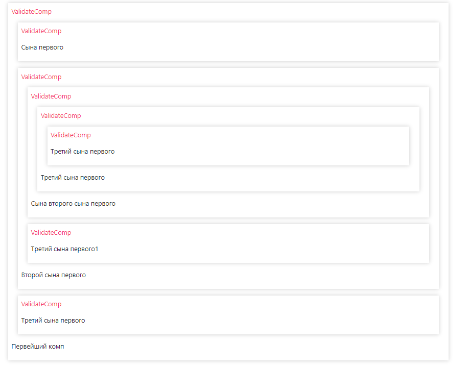

# Test
После первого рефакторинга решил все-таки залить на гитхаб.

Разбил задачу на 4 шага.
1. Создание общей структуры.
2. Приведение данных поступающих с бека в древовидную структуру.
3. Рендер компонентов из дерева.
4. Добавление метода, вызывающий у дочерних компонентов компонента validate тот же метод на глубине не больше 1.

Приведение плоскости в древовидную струтуку оказалось слишком ёмкой задачей, решил полагаться, что данные придут изначально в древовидной струтуе.

С 4 шагом не справился. Попытался через node сделать, но не придумал как. Не представляю как такое реализовать, отложу до лучших времен.

​
